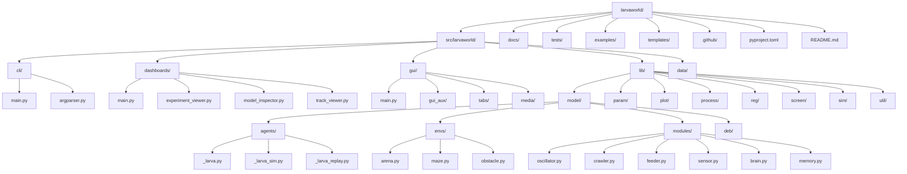
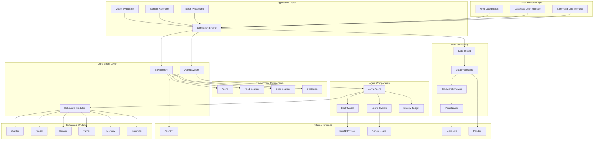
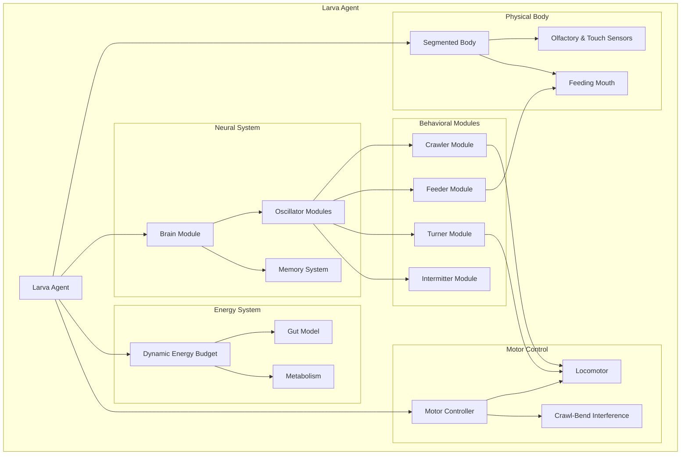
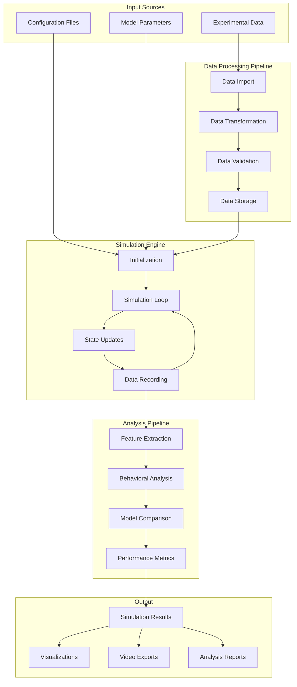
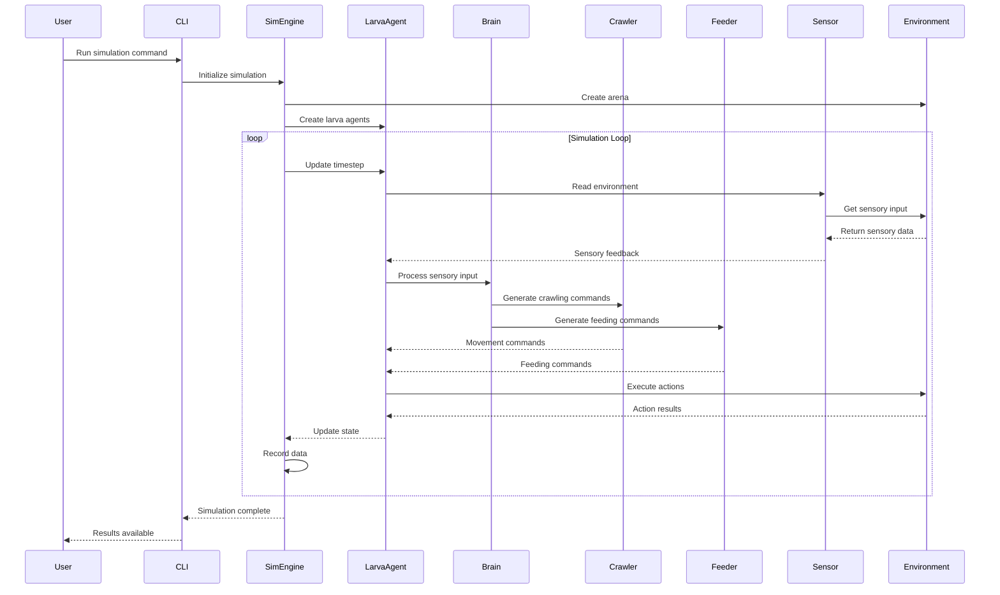
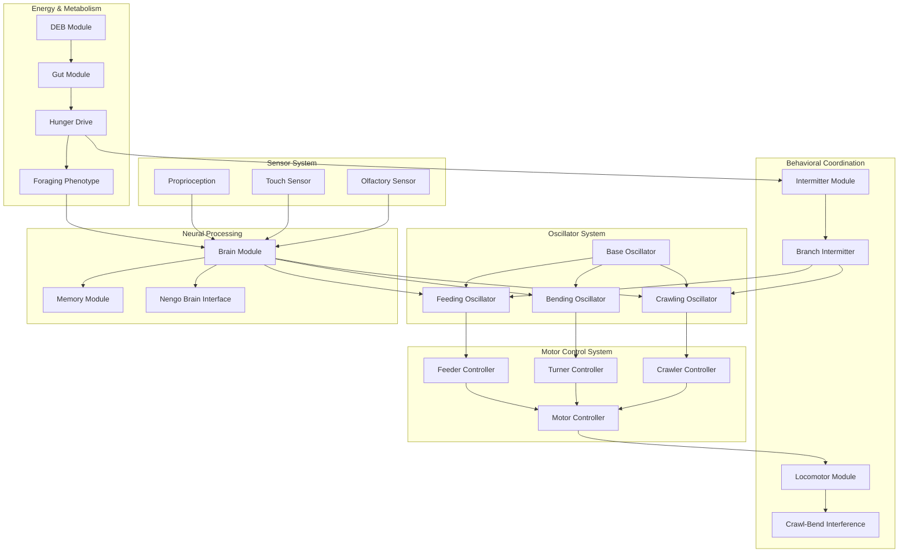
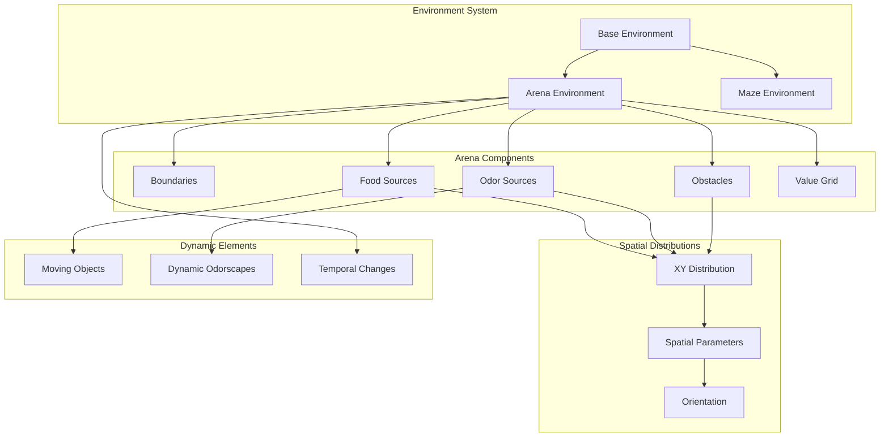
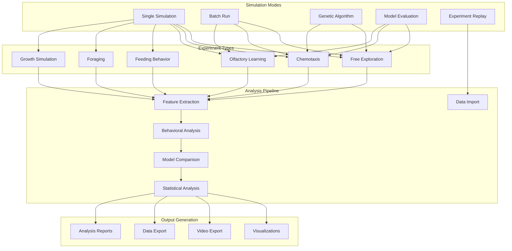
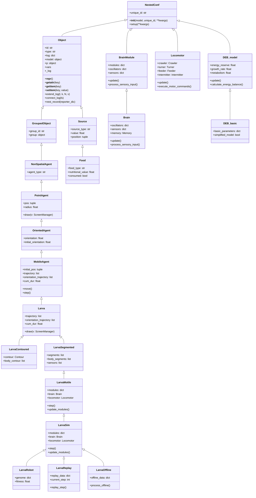

# Larvaworld Architecture Diagrams

## 1. Project Structure Diagram

## 2. System Architecture Diagram

## 3. Larva Model Architecture

## 4. Data Flow Diagram

## 5. Module Interaction Diagram

## 6. Technology Stack Diagram

```mermaid
graph TB
    subgraph "Frontend/UI"
        CLI_UI[Command Line Interface]
        GUI_UI[Graphical User Interface]
        WEB_UI[Web Dashboards]
    end
    
    subgraph "Core Framework"
        PYTHON[Python 3.8+]
        AGENTPY[AgentPy Framework]
        PARAM[Param Library]
    end
    
    subgraph "Scientific Computing"
        NUMPY[NumPy]
        PANDAS[Pandas]
        SCIPY[SciPy]
        SKLEARN[Scikit-learn]
    end
    
    subgraph "Visualization"
        MATPLOTLIB[Matplotlib]
        SEABORN[Seaborn]
        HOLOVIEWS[HoloViews]
        PANEL[Panel]
    end
    
    subgraph "Physics & Neural"
        BOX2D[Box2D Physics Engine]
        NENGO[Nengo Neural Simulator]
    end
    
    subgraph "Data Processing"
        GEOPANDAS[GeoPandas]
        SHAPELY[Shapely]
        MOVINGPANDAS[MovingPandas]
    end
    
    subgraph "Development Tools"
        POETRY[Poetry Package Manager]
        PYTEST[Pytest Testing]
        RUFF[Ruff Linting]
        PRECOMMIT[Pre-commit Hooks]
    end
    
    CLI_UI --> PYTHON
    GUI_UI --> PYTHON
    WEB_UI --> PYTHON
    
    PYTHON --> AGENTPY
    PYTHON --> PARAM
    
    AGENTPY --> NUMPY
    AGENTPY --> PANDAS
    AGENTPY --> SCIPY
    
    PYTHON --> MATPLOTLIB
    PYTHON --> SEABORN
    PYTHON --> HOLOVIEWS
    PYTHON --> PANEL
    
    PYTHON --> BOX2D
    PYTHON --> NENGO
    
    PYTHON --> GEOPANDAS
    PYTHON --> SHAPELY
    PYTHON --> MOVINGPANDAS
    
    PYTHON --> POETRY
    PYTHON --> PYTEST
    PYTHON --> RUFF
    PYTHON --> PRECOMMIT
```

## 7. Behavioral Modules Detailed Architecture

## 8. Environment and Arena Architecture

## 9. Simulation Modes and Workflows

## 10. Class Hierarchy and Inheritance Diagram

## Diagram Descriptions

### 1. Project Structure Diagram
Shows the hierarchical structure of the project with main folders and files. Larvaworld has a clean modular structure with separate modules for CLI, GUI, dashboards, and the core library.

### 2. System Architecture Diagram
Illustrates the high-level system architecture with main layers:
- **User Interface Layer**: CLI, GUI, Web interfaces
- **Application Layer**: Simulation engine, batch processing, genetic algorithms
- **Core Model Layer**: Agent system, environment, behavioral modules
- **Data Processing**: Import, analysis, visualization

### 3. Larva Model Architecture
Shows the internal structure of the Larva Agent with main components:
- **Physical Body**: Segmented body with sensors and mouth
- **Neural System**: Brain, oscillators, memory
- **Behavioral Modules**: Crawler, feeder, turner, intermitter
- **Energy System**: Dynamic Energy Budget (DEB) model
- **Motor Control**: Motor controller and locomotor

### 4. Data Flow Diagram
Illustrates the data flow from input sources to output results, showing processing stages, simulation, and analysis.

### 5. Module Interaction Diagram
Shows the interaction between modules during a simulation, with sequence diagram illustrating command and response flow.

### 6. Technology Stack Diagram
Illustrates all technologies and libraries used by the project, organized into categories like frontend, core framework, scientific computing, visualization, etc.

### 7. Behavioral Modules Detailed Architecture
Illustrates the detailed architecture of larvaworld's behavioral modules, showing:
- **Oscillator System**: Basic oscillators for crawling, bending, and feeding
- **Motor Control System**: Controllers that convert oscillator signals to motor commands
- **Sensor System**: Various sensors (olfactory, touch, proprioception)
- **Behavioral Coordination**: Modules that coordinate behavior
- **Neural Processing**: Brain and memory modules
- **Energy & Metabolism**: DEB model and foraging phenotypes

### 8. Environment and Arena Architecture
Shows the environment system architecture with:
- **Environment Types**: Arena, maze environments
- **Arena Components**: Boundaries, food sources, odor sources, obstacles
- **Spatial Distributions**: XY distributions and spatial parameters
- **Dynamic Elements**: Moving objects and dynamic odorscapes

### 9. Simulation Modes and Workflows
Illustrates different simulation modes and workflows:
- **Simulation Modes**: Single, batch, genetic algorithm, evaluation, replay
- **Experiment Types**: Various experiment types
- **Analysis Pipeline**: Data analysis pipeline
- **Output Generation**: Various system outputs

### 10. Class Hierarchy and Inheritance Diagram
Illustrates the class hierarchy and inheritance relationships in the larvaworld project:

**Base Classes:**
- **NestedConf**: Base class for all parameterized objects
- **Object**: Base class for all ABM objects
- **GroupedObject**: Class for objects belonging to groups

**Agent Hierarchy:**
- **NonSpatialAgent**: Base class for agents
- **PointAgent**: Agent with position and radius
- **OrientedAgent**: Agent with orientation
- **MobileAgent**: Agent that can move
- **Larva**: Base class for larva agents

**Larva Specializations:**
- **LarvaContoured**: Larva with contour representation
- **LarvaSegmented**: Larva with segmented body
- **LarvaMotile**: Larva with motor capabilities
- **LarvaSim**: Larva for simulations
- **LarvaRobot**: Larva for genetic algorithms
- **LarvaReplay**: Larva for replay experiments
- **LarvaOffline**: Larva for offline processing

**Environment Objects:**
- **Source**: Base class for sources
- **Food**: Specialized source for food

**Behavioral Modules:**
- **BrainModule**: Base class for brain modules
- **Brain**: Main brain implementation
- **Locomotor**: Motor control system
- **DEB_model**: Dynamic Energy Budget model
- **DEB_basic**: Simplified DEB implementation

These diagrams provide a comprehensive view of the larvaworld project architecture and help understand its structure and functionality.
